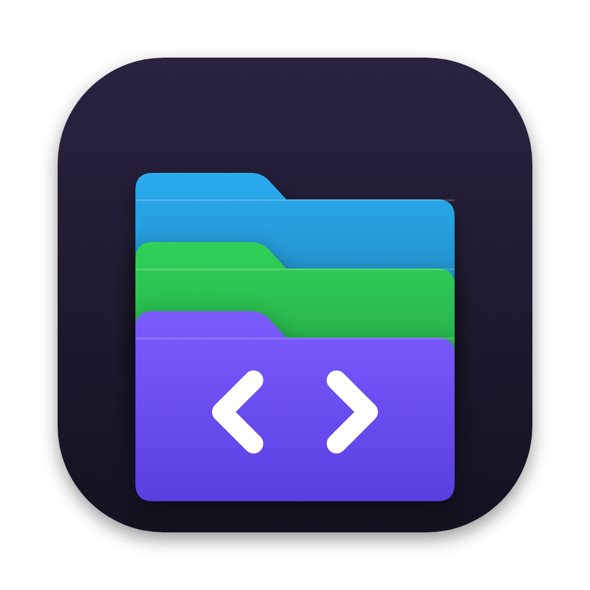

<p align="center">
  
</p>

<h1 align="center">Hangar</h1>

<p align="center">
  All your projects in one window, sorted by what they are.<br>
  <b>C++20 · std::filesystem · Qt 6 / QML · QtConcurrent</b>
</p>

---

Projects end up scattered: `CLionProjects`, `PycharmProjects`, a random `my_code`, an `src` on the home folder. Hangar watches those folders, looks inside every project and sorts it into **Mini Apps, Bots, Sites, Apps, Games, Scripts, Study and Archive** — then opens it in the right IDE with one click.

## Features

- **Knows what a project is.** It reads imports and dependencies, not file names: `aiogram` or `telebot` → bot; a bot plus `Telegram.WebApp` or a FastAPI backend → Mini App; React/Vite or HTML pages → site; Qt, Flet, Tkinter → app; raylib, pygame → game; `PythonProject7`, labs → study; `— копия`, `_backup` → archive. Every card says why ("Telegram WebApp in frontend/app.js").
- **Tags** for the stack: Python, aiogram, FastAPI, SQLAlchemy, Docker, React, Vite, Qt…
- **Git at a glance**: branch, last commit time, a button to the GitHub repo.
- **Opens in the right place**: CLion for CMake, PyCharm for Python (and anything with a `.venv`), VS Code for web. Also Finder, Terminal, copy path.
- **Drag and drop**: drop a folder of projects to watch it, or a single project to add it.
- **Manual override**: right-click → Category, remembered.
- **Delete to Trash**, recoverable from Finder, with a warning when the project isn't on GitHub (that folder may be the only copy). Links in the organised tree are cleaned up too. Or just **remove from the list**: the folder stays, Hangar remembers not to show it ("Show hidden" brings them back).
- **Sort into folders** without breaking anything: builds `~/Projects/Боты/…`, `~/Projects/Сайты/…` out of *symlinks*. Real folders stay where they are, so virtualenvs (which store absolute paths), CMake build directories and IDE project lists keep working. Re-running updates the links and only ever removes symlinks.
- Search by name or stack, quiet live updates (only when a project folder appears or disappears; the list never jumps), light and dark theme.

## Architecture

```
src/
├── core/               # plain C++20, no Qt -> unit-tested on a fake home folder
│   ├── Project         # finding projects, reading signals, classification, git, editors
│   └── Organizer       # symlink plan + idempotent apply/cleanup
├── app/
│   ├── AppController   # folders, overrides, background scan (QtConcurrent), actions
│   └── ProjectModel    # filtered, sorted list model for QML
qml/                    # sidebar, cards, organise dialog, drag and drop
tests/                  # classification of 23 real-world-like projects, git parsing, organiser
```

Notable decisions:

- **Signals, strongest first.** Each project is scanned two levels deep (skipping `node_modules`, `.venv`, build output), up to 80 source files read partially. The first matching rule wins: archive name → empty → Mini App → bot → game → desktop → study name → site → script. JS frameworks only count in projects that actually contain JS, so a Qt app whose QML says "next" isn't tagged Next.js.
- **Symlinks instead of moving.** Moving a Python project breaks its `.venv`; moving a CMake project breaks its build cache. A tree of links gives the folders without either problem.
- **Git without git.** Branch from `.git/HEAD`, last commit from the reflog, remote from `.git/config`: no process per project, a full scan of 40 projects is instant.

## Building

```bash
brew install qt cmake ninja

cmake -S . -B build -G Ninja -DCMAKE_PREFIX_PATH="$(brew --prefix qt)"
cmake --build build && ctest --test-dir build
open build/Hangar.app

./scripts/package.sh --install   # standalone Hangar.app + .dmg
```

Requires macOS 13+.

## License

MIT
